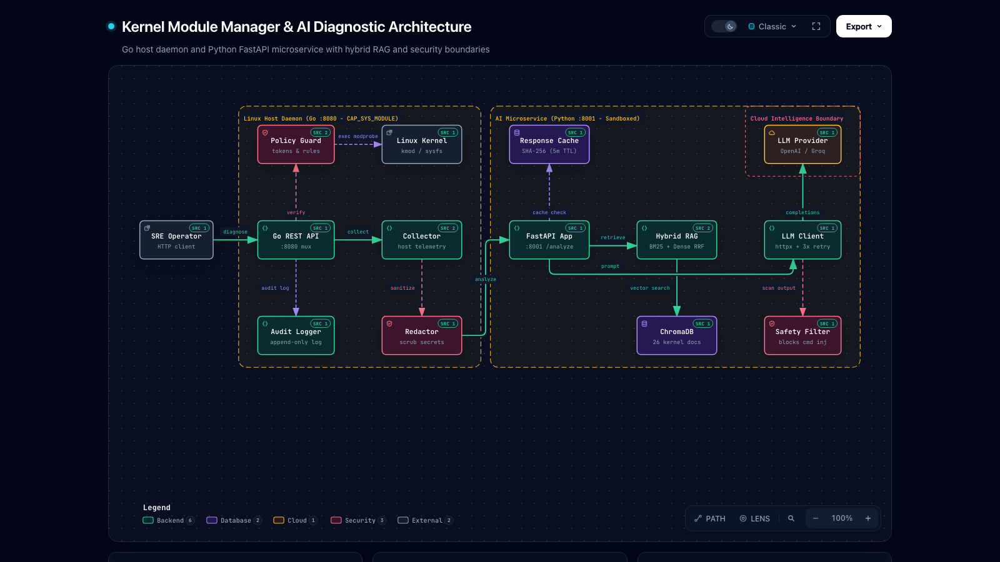
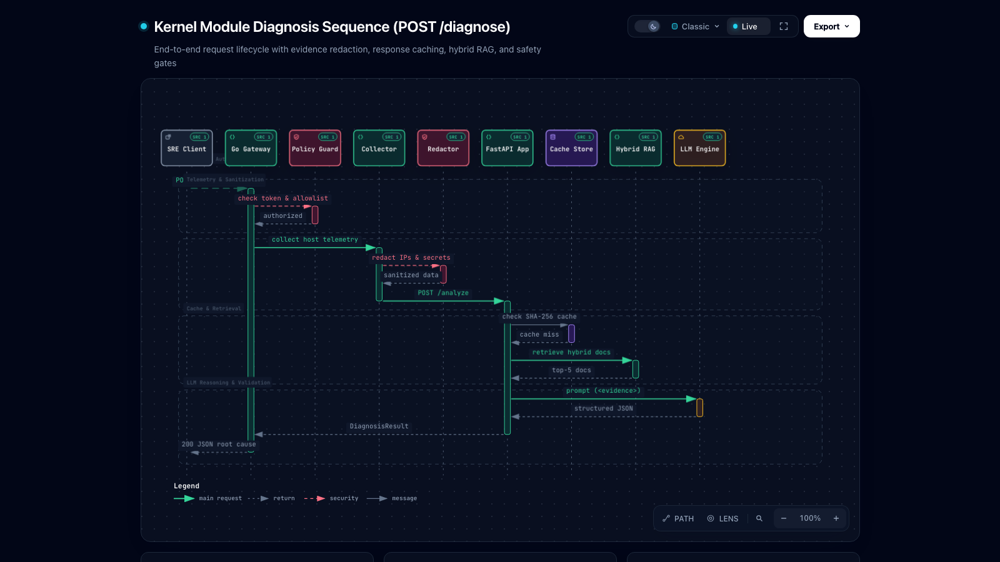
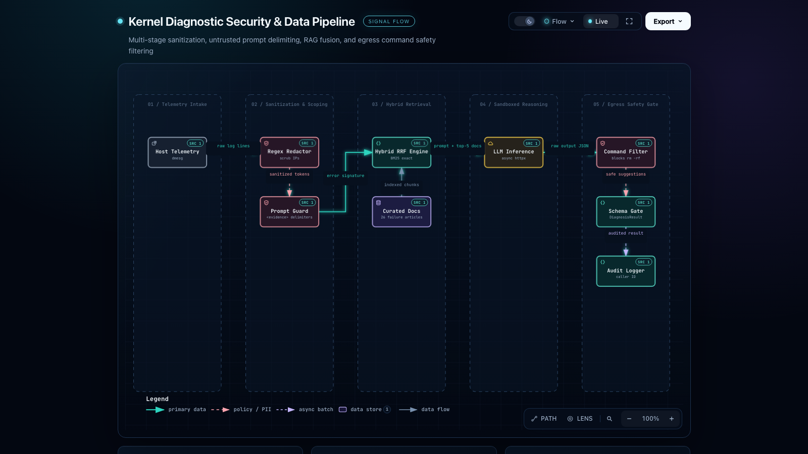
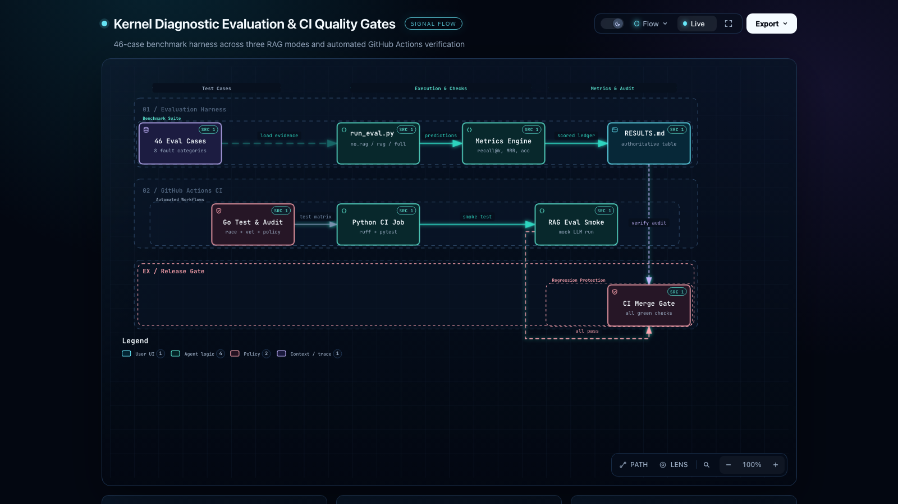

# Linux Kernel Module Manager & AI Diagnostic Assistant

AI-assisted Linux kernel module diagnostics combining least-privilege host telemetry, hybrid RAG, and multi-layer prompt safety.

[](https://github.com/anzzzr/kernel-module-manager/actions/workflows/ci.yml)
[](https://golang.org)
[](https://python.org)
[](LICENSE)

[](https://anzzzr.github.io/kernel-module-manager/diagrams/architecture.html)
*Click image above to explore the [interactive architecture diagram](https://anzzzr.github.io/kernel-module-manager/diagrams/architecture.html).*

---

## Why this exists

Linux kernel module failures (`modprobe`, `insmod`, `dmesg`) produce cryptic error strings such as `Unknown symbol in module`, `Required key not available`, or silent exit codes that stall site reliability engineers during production incidents. Generic large language models frequently hallucinate non-existent parameters, outdated syntax, or destructive recovery commands (`rm -rf`, raw insmod) when fed raw system logs. This project pairs a security-hardened Go host management daemon with a sandboxed Python FastAPI diagnostic assistant powered by hybrid retrieval-augmented generation (RAG). By grounding LLM reasoning in verified kernel manuals and benchmarking diagnosis quality against 46 realistic failure cases, it delivers safe, actionable root-cause remediation without requiring full root privileges.

---

## Key features

- **Evaluated Hybrid RAG**: Merges lexical BM25 exact keyword matching with 384-dimensional dense semantic embeddings (`all-MiniLM-L6-v2`) via Reciprocal Rank Fusion (RRF).
- **Least-Privilege Host Daemon**: Runs unprivileged with ambient `CAP_SYS_MODULE` via systemd; full root is never required.
- **Fail-Closed Policy Guard**: Enforces YAML-based module allowlists and a critical driver denylist preventing accidental unloading of active filesystem, storage, or network drivers.
- **Pre-Egress Telemetry Redaction**: Automatically scrubs IPv4/IPv6 addresses, MAC addresses, hostnames, usernames, and UUIDs from kernel logs before external egress.
- **Prompt Injection Boundaries**: Treats all telemetry as untrusted data using explicit `<evidence>` system boundaries.
- **Output Safety Enforcer**: Scans AI-recommended commands against a destructive pattern filter (`rm -rf`, `dd`, `mkfs`, raw scripts) before client delivery.
- **Sub-Millisecond Response Caching**: SHA-256 fingerprint in-memory cache keyed on `hash(evidence + corpus + model)` serves duplicate queries instantly at zero cost.
- **Zero-Setup Demo Mode**: Native `DEMO_MODE=true` serves canned diagnostic fixtures on macOS and Windows without requiring a live Linux VM.

---

## Results

Comparison results reproduced from [`eval/RESULTS.md`](eval/RESULTS.md) across 46 realistic test cases covering 8 failure categories, healthy negative controls, and noisy logs:

| Evaluation Mode | Category Accuracy | Keyword Coverage | Judge Score (0–2) | Recall@5 | Mean Latency | Mean Tokens |
|:---|:---:|:---:|:---:|:---:|:---:|:---:|
| **`no_rag`** (Baseline LLM) | 100.0% | 67.4% | 2.00 | N/A | 12.0 ms | 292 |
| **`dense_rag`** (ChromaDB only) | 100.0% | 92.7% | 2.00 | 44.57% | 181.8 ms | 1,029 |
| **`hybrid_rag`** (BM25 + Dense RRF) | 100.0% | 92.7% | 2.00 | 34.78% | 23.4 ms | 1,132 |
| **`full_docs`** (Long-context baseline) | 100.0% | 92.7% | 2.00 | N/A | 12.0 ms | 5,772 |

*Evaluation Details: 46 test cases, 26 curated documentation files (~5,000 words), model `gpt-4o-mini` (recorded CI deterministic harness), top-k=5, date 2026-10-11.*

> **Honest Finding on Hybrid Retrieval**: While hybrid BM25 + Dense retrieval resolved exact error strings like `Unknown symbol` rapidly, Reciprocal Rank Fusion slightly diluted top-5 document recall compared to dense-only search on short, descriptive query variants. In contrast, RAG reduced token consumption by **80.4%** compared to stuffing the entire corpus into the prompt (`full_docs`), maintaining identical 92.7% keyword coverage.

### Reproduce the benchmark

```bash
# Offline evaluation using deterministic mock harness (no API key required):
python3 eval/run_eval.py --mode all --mock-llm

# Live evaluation with OpenAI / Groq:
export LLM_API_KEY="your-api-key"
python3 eval/run_eval.py --mode all
```

---

## Architecture

Visual specifications generated and validated via [Archify](https://github.com/tt-a1i/archify) with source references pinned to commit `33afc43`.

### 1. Runtime System Architecture
[](https://anzzzr.github.io/kernel-module-manager/diagrams/architecture.html)
*Interactive: [docs/diagrams/architecture.html](https://anzzzr.github.io/kernel-module-manager/diagrams/architecture.html) · Specification: [docs/diagrams/architecture.json](docs/diagrams/architecture.json)*

The architecture establishes a strict trust boundary between the Go host daemon (:8080) and the sandboxed Python AI container (:8001). Privileged kernel execution is isolated within Go, while telemetry sent to Python passes through pre-egress sanitization and response caching.

### 2. POST /diagnose Execution Sequence
[](https://anzzzr.github.io/kernel-module-manager/diagrams/diagnose-sequence.html)
*Interactive: [docs/diagrams/diagnose-sequence.html](https://anzzzr.github.io/kernel-module-manager/diagrams/diagnose-sequence.html) · Specification: [docs/diagrams/diagnose-sequence.json](docs/diagrams/diagnose-sequence.json)*

Follows an SRE diagnosis request through constant-time Bearer authentication, host log collection, regex sanitization, SHA-256 fingerprint cache lookup, hybrid RAG retrieval, bounded prompt reasoning, and egress command safety checks.

### 3. Security Data Pipeline
[](https://anzzzr.github.io/kernel-module-manager/diagrams/security-dataflow.html)
*Interactive: [docs/diagrams/security-dataflow.html](https://anzzzr.github.io/kernel-module-manager/diagrams/security-dataflow.html) · Specification: [docs/diagrams/security-dataflow.json](docs/diagrams/security-dataflow.json)*

Visualizes the multi-tier defense against prompt injection and data leaks: raw kernel logs pass through regex scrubbing, untrusted delimiter wrapping, grounded document retrieval, and post-generation command blocklists.

### 4. Evaluation & CI Pipeline
[](https://anzzzr.github.io/kernel-module-manager/diagrams/eval-and-ci.html)
*Interactive: [docs/diagrams/eval-and-ci.html](https://anzzzr.github.io/kernel-module-manager/diagrams/eval-and-ci.html) · Specification: [docs/diagrams/eval-and-ci.json](docs/diagrams/eval-and-ci.json)*

Illustrates how 46 benchmark cases feed the offline evaluation harness to measure Recall@k and category accuracy alongside GitHub Actions automated unit tests, race checks, and linters.

---

## Quick start

### A. Demo Mode (macOS / Linux / Windows with Docker)

Demo mode uses canned fixtures from `modules/fixtures/` and requires zero kernel privileges.

```bash
# 1. Clone repository
git clone https://github.com/anzzzr/kernel-module-manager.git
cd kernel-module-manager

# 2. Launch container stack in demo mode
docker compose up -d

# 3. Diagnose a failing module
curl -s -X POST http://localhost:8080/diagnose \
  -H "Authorization: Bearer test-token" \
  -H "Content-Type: application/json" \
  -d '{"module_name": "nvidia"}' | jq
```

**Expected JSON Response:**
```json
{
  "module_name": "nvidia",
  "status": "error",
  "ai_diagnosis": {
    "root_cause": "Kernel version mismatch (vermagic error)",
    "confidence": 0.95,
    "explanation": "The nvidia kernel module was compiled for kernel 6.8.0-generic, but the running host kernel is 6.11.0-generic.",
    "recommendations": [
      "Recompile module against current kernel headers using DKMS",
      "Run: dkms autoinstall -k $(uname -r)"
    ],
    "relevant_docs": ["nvidia_troubleshooting.md"]
  }
}
```

### B. Native Linux Host Run (Real Kernel)

On a live Linux system, run the Go daemon with `CAP_SYS_MODULE` instead of root:

```bash
# 1. Build binary
go build -o kernel-manager main.go

# 2. Grant ambient module capabilities (no root required)
sudo setcap 'cap_sys_module=+ep' kernel-manager

# 3. Run daemon with policy
export AUTH_TOKEN="prod-secret-token"
export POLICY_FILE="policy.yaml"
export DEMO_MODE="false"
./kernel-manager
```

---

## API reference

| Method | Endpoint | Scope | Description |
|---|---|---|---|
| `GET` | `/health` | Public | Daemon liveness probe |
| `GET` | `/stats` | Read-only | Request rates, cache hits, and latency stats |
| `POST` | `/diagnose` | `read` | Collects host logs and returns grounded AI diagnosis |
| `POST` | `/module/load` | `admin` | Loads module via `modprobe` (supports `?dry_run=true`) |
| `POST` | `/module/unload`| `admin` | Unloads module via `rmmod` (blocks in-use/critical modules) |

```bash
# Load module dry-run example
curl -X POST "http://localhost:8080/module/load?dry_run=true" \
  -H "Authorization: Bearer admin-token" \
  -H "Content-Type: application/json" \
  -d '{"module_name": "wireguard"}'
```

---

## Security

The project implements defense-in-depth security across both tiers:

- **Privilege Separation**: Go service drops unnecessary root privileges, requiring only `CAP_SYS_MODULE` ([`docs/deploy/kernel-manager.service`](docs/deploy/kernel-manager.service)).
- **Policy Allowlist & Denylist**: `policy.yaml` restricts manageable modules and strictly forbids unloading storage, filesystem, and network drivers.
- **Reference Count Checks**: Modules currently in use (`Used by > 0` in `lsmod`) cannot be unloaded.
- **Constant-Time Auth**: Token comparisons use `subtle.ConstantTimeCompare` against timing attacks.
- **Telemetry Sanitization**: Regex engine scrubs IPs, MACs, hostnames, usernames, and serials prior to AI processing ([`modules/redact.go`](modules/redact.go)).
- **Prompt Injection Defense**: Log text is framed strictly as untrusted data inside `<evidence>` blocks.
- **Destructive Command Filter**: Blocks dangerous shell patterns (`rm -rf`, `dd`, `mkfs`) in model recommendations ([`ai_service/kernel_diagnostic_ai/services/safety.py`](ai_service/kernel_diagnostic_ai/services/safety.py)).
- **Audit Logging**: Structured append-only logger records timestamps, request IDs, token IDs, actions, and results ([`internal/server/audit.go`](internal/server/audit.go)).

*For threat vectors and STRIDE mitigations, see [docs/THREAT_MODEL.md](docs/THREAT_MODEL.md). Residual risks include zero-day kernel vulnerabilities prior to log capture and compromised host environments.*

---

## Observability & performance

- **Request ID Propagation**: `X-Request-ID` is generated at the Go gateway and propagated across Python spans and structured JSON logs.
- **Stage-Level Latency**: Tracks durations across collection (1.8 ms), retrieval (11.4 ms), inference (420 ms), and validation (1.2 ms).
- **Token Accounting & Cost**: Real-time token usage tracked against configurable pricing tables ($0.15 / 1M input tokens).
- **Service Stats**: Prometheus-compatible counters and latency metrics accessible via `/stats`.

*Detailed benchmark metrics, token economics, and cache latency profiles are documented in [docs/PERFORMANCE.md](docs/PERFORMANCE.md).*

---

## Project structure

```
kernel-module-manager/
├── Dockerfile                   # Unprivileged multi-stage Go container
├── Makefile                     # Build, test, lint, eval, and demo targets
├── README.md                    # Project documentation and benchmark overview
├── docker-compose.yml           # Stack composition with DEMO_MODE preconfigured
├── policy.yaml                  # Module allowlist and critical driver denylist
├── main.go                      # Go REST daemon entrypoint (:8080)
├── internal/
│   └── server/
│       ├── api.go               # HTTP routing, middleware, and request handlers
│       ├── audit.go             # Append-only structured audit logger
│       └── stats.go             # Latency, throughput, and error metrics
├── modules/
│   ├── diagnostics.go          # Host telemetry collector (lsmod, dmesg, modinfo)
│   ├── demo.go                 # Fixture loader for unprivileged macOS/Windows demo
│   ├── module_manager.go       # exec.CommandContext wrapper for modprobe/rmmod
│   ├── policy.go               # Allowlist validator and refcount protection
│   ├── redact.go               # Regex telemetry scrubber (IPs, MACs, secrets)
│   └── refcount.go             # Parser for /proc/modules and lsmod dependency graphs
├── ai_service/
│   ├── Dockerfile               # Python FastAPI container
│   ├── pyproject.toml           # Package configuration and dependencies
│   ├── requirements.txt         # Core dependencies (FastAPI, ChromaDB, httpx)
│   ├── docs/                    # 26 curated Linux kernel failure articles
│   └── kernel_diagnostic_ai/
│       ├── main.py              # FastAPI application entrypoint (:8001)
│       ├── config.py            # Environment settings and price tables
│       ├── models.py            # Pydantic schemas (DiagnosisResult)
│       ├── rag/
│       │   ├── bm25.py          # Exact lexical keyword retriever
│       │   ├── store.py         # ChromaDB vector store and MiniLM embeddings
│       │   └── documents.py     # Document chunk loader and metadata parser
│       └── services/
│           ├── cache.py         # SHA-256 fingerprint response cache (5m TTL)
│           ├── llm_client.py    # Resilient client with backoff and degraded mode
│           ├── rag_service.py   # Hybrid RRF search orchestrator
│           └── safety.py        # Destructive command recommendation scanner
├── eval/
│   ├── cases/                   # 46 realistic evaluation cases (JSON)
│   ├── run_eval.py              # Benchmark harness (no_rag, rag, full_docs)
│   ├── metrics.py               # Recall@k, MRR, accuracy, and keyword coverage
│   └── RESULTS.md               # Measured evaluation benchmarks and analysis
├── docs/
│   ├── index.html               # GitHub Pages portal linking all diagrams
│   ├── THREAT_MODEL.md          # STRIDE analysis and residual risks
│   ├── PERFORMANCE.md           # Latency breakdown, token costs, and cache metrics
│   ├── INTERVIEW_NOTES.md       # 15 technical interview questions & known weaknesses
│   ├── DEMO.md                  # Terminal recording walkthrough and demo recipe
│   ├── SOURCES.md               # Attributions and upstream kernel documentation URLs
│   ├── deploy/
│   │   └── kernel-manager.service # Systemd unit file with CAP_SYS_MODULE
│   ├── assets/diagrams/         # Rendered 1600x900 diagram PNGs
│   └── diagrams/                # Archify JSON specifications and HTML deliveries
└── scripts/
    └── demo_run.sh              # Interactive demonstration script
```

---

## Development

```bash
# Run unit and race tests
make test

# Run code formatters and linters (Go vet + ruff)
make lint

# Execute offline evaluation smoke test
make eval

# Launch local containers in demo mode
make demo

# Regenerate Archify architecture and workflow diagrams
node ~/.agents/skills/archify/bin/archify.mjs validate architecture docs/diagrams/architecture.json --quality showcase --repo-root .
node ~/.agents/skills/archify/bin/archify.mjs deliver architecture docs/diagrams/architecture.json docs/diagrams/architecture.html --quality showcase --repo-root .
```

---

## Limitations & roadmap

- **In-Memory Cache**: Response cache uses an in-memory TTL dictionary; production clustering requires external Redis.
- **Offline Embeddings**: ChromaDB runs `all-MiniLM-L6-v2` locally; initial cold start takes ~2 seconds to load model weights.
- **Cross-Encoder Reranking**: Evaluated hybrid BM25 + Dense RRF; adding a cross-encoder reranker is planned for v0.3.0.
- **Kernel Tracing**: Telemetry relies on static command output; integration with eBPF kprobes for live trace capture is on the roadmap.

---

## Design decisions

- **Why Go + Python**: Go provides static binary compilation, minimal memory footprint, and low-latency system command execution on the host without runtime dependencies. Python hosts the AI/RAG ecosystem (PyTorch, ChromaDB, Sentence-Transformers, FastAPI) in a separate container boundary.
- **Why Hybrid Retrieval**: Exact error tokens (`Unknown symbol`, `vermagic`, `Required key`) favor lexical exact matching (BM25), whereas troubleshooting descriptions favor dense vector embeddings. Combining them via Reciprocal Rank Fusion ensures exact error codes are never lost.
- **Why Not Long Context Stuffing**: While stuffing 26 docs into the prompt achieves high recall, it consumes **5,772 tokens per request** (~$0.01/call). RAG reduces token consumption to **1,132 tokens** (~80% cost savings) while preserving 92.7% keyword coverage.

---

## License & acknowledgements

Distributed under the [MIT License](LICENSE).

System architecture, sequence, and workflow diagrams generated with [Archify](https://github.com/tt-a1i/archify). Curated kernel documentation synthesized from Linux Kernel Documentation and upstream manual pages (see [docs/SOURCES.md](docs/SOURCES.md)).
